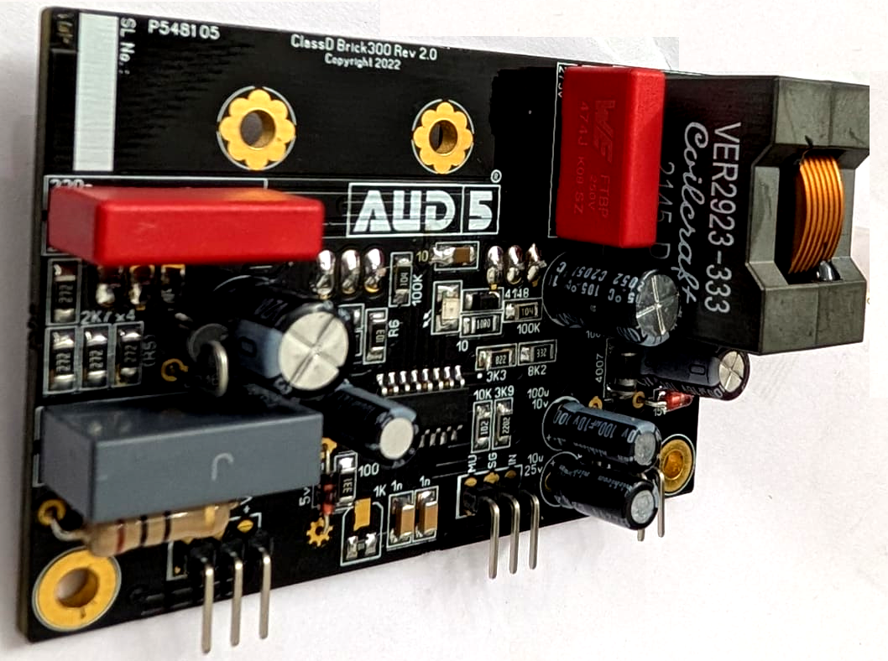
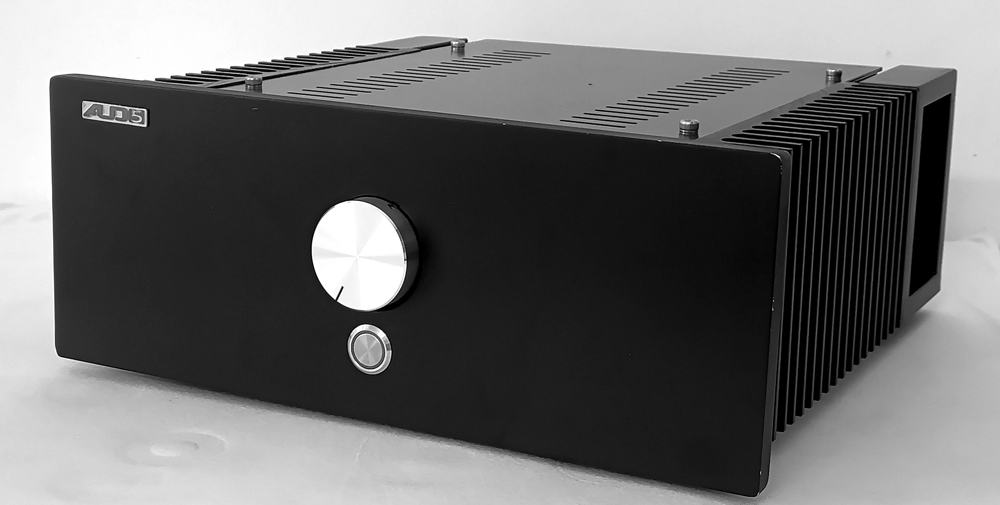

# _Aud5_

Aud5 is a brand of audiophile grade amplifiers, designed and manufactured at Ernakulam, Kerala. We have MOSFET based _class A_ and _class D_ amplifiers in our portfolio. 

## _Class D Amp_

Our class D amplifiers are designed to give exceptional performance. They are capable of delivering a stunning sound stage with good separation. 

They feature a custom made high quality PCB, populated with audiophile grade components and comes with features like dethumping, voltage and speaker protection built into the system. Our passive cooling design keeps the device cool even in the most demanding applications. There are no relays in the speaker line, which means the output lines remain the same electrically, throughout the lifetime of the device.

### _Customizable Pre-Amps_

The input section of each Aud5 class D amp has a high performance, audio grade operational amplifier based pre-amp. The customer can choose an op-amp, according to his/her tastes, from a host of options which are made available. 

### _Scalable_

Aud 5 Class D amps can be setup for out put power levels upto 900 W _rms_. This enables it to be used as a simple integrated amplifier for the discerning audiophile. On the other hand a Aud5 amp can be used to setup a Dolby Atmos enabled home cinema system as well.

### _Demo_

At the moment pne unit of Aud5 integrated amplifier for home use, is made available for testing purposes. This will enable the customer to check if the product will suit his/her needs and whether it will perform as expected under the actual listening conditions. Several of our customers have made use of this facility and hence are enjoying the product which they purchased afterwards to the fullest.

